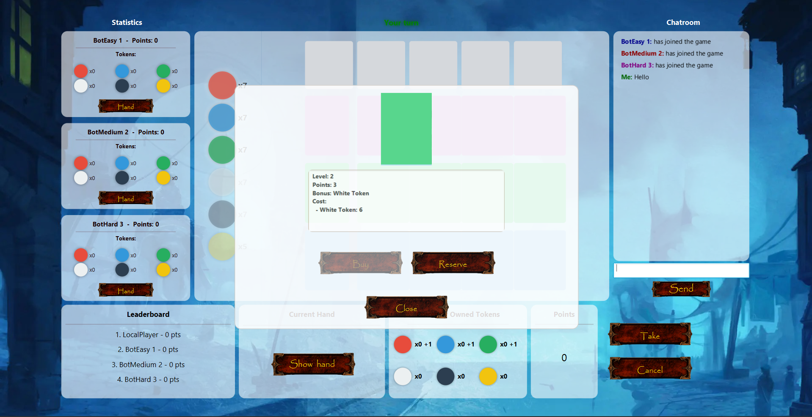
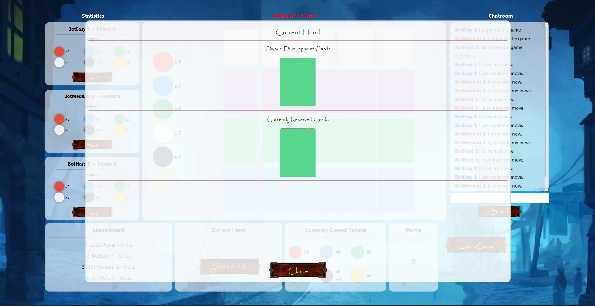
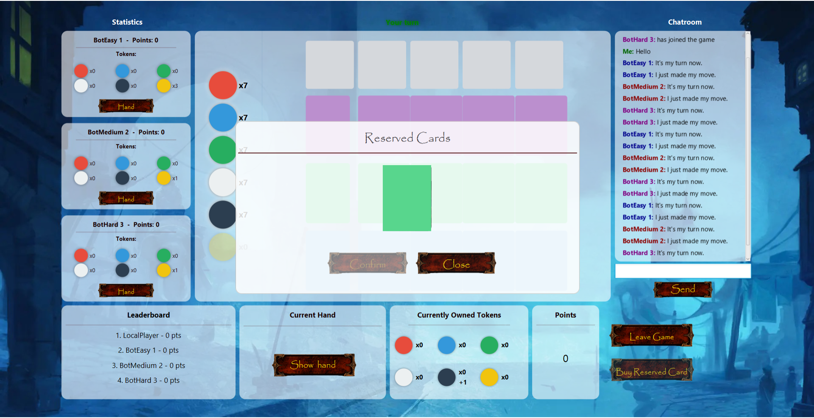
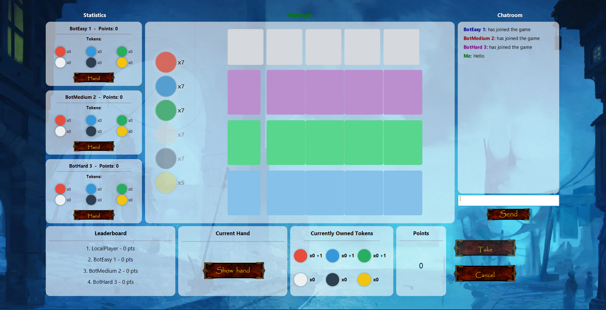
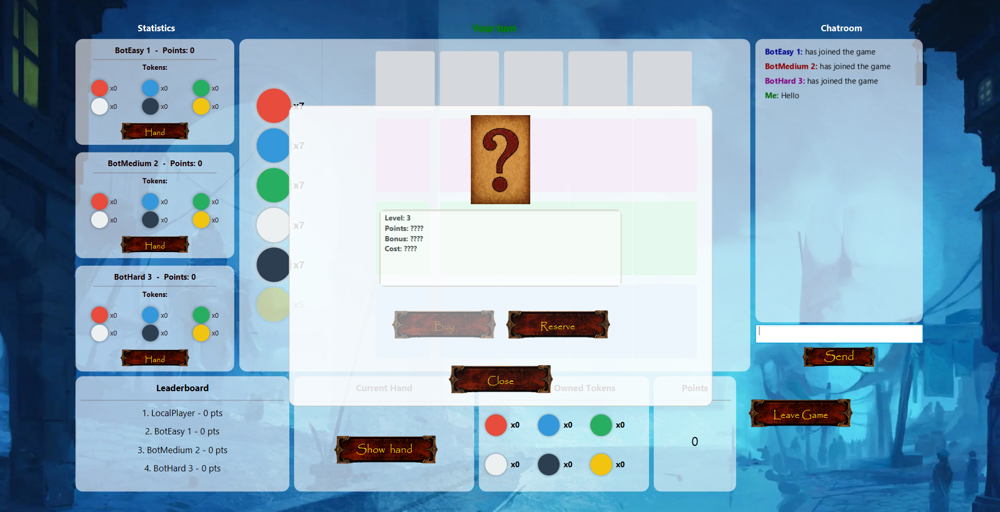
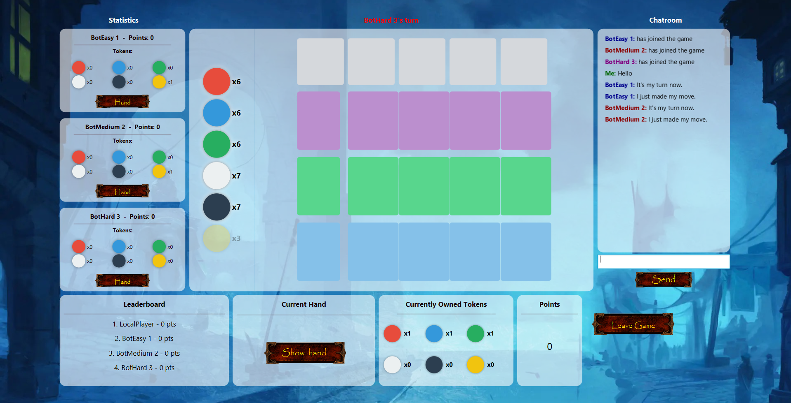
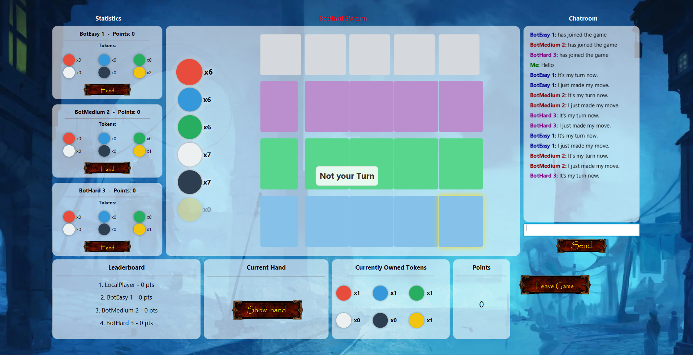

# 🎮 JavaFX Game UI

A visual showcase of the **in-game user interface** I developed as part of a university project.  
All assets were recolored and neutralized to comply with NDA restrictions — only the visual layout and interaction design are shown here.

---

## Screenshots

| Screenshot | Description |
|-------------|-------------|
|  | Main GameView showing overall board layout, player statistics, and chatroom. |
|  | Layout whenever the local player decides to buy a card. |
|  | Expanded player hand and reserved card overview window.  |
|  | Example of reserved card overlay with modal interaction. |
|  | Turn-based state changes visualized in the board grid and the token boxes. |
|  | Showing a mistery card, whenever the player clicks on special cards. |
|  | Mid-game layout featuring color-coded turns (top center) and player status updates. |
|  | Responsive design that indicates if a player can buy a card (and if it is the players turn, if the player decides to make an action) |

---

## Features

- Built with **JavaFX**
- Structured using the **MVC (Model-View-Controller)** pattern
- Components:
  - Player stats panels and **leaderboard**
  - **Interactive chatroom**
  - Dynamic **turn indicator**
  - Modal overlays for **buying, reserving, and viewing cards**
  - Color-coded placeholders for clean UI visualization
- Responsive grid-based layout using `VBox`, `HBox`, and `GridPane`

---

## What I Learned

- Designing and implementing multi-component UIs in **JavaFX**
- Managing **scene graph hierarchies** and layout containers
- Synchronizing **front-end state** with backend logic
- Building modular, scalable views using **MVC principles**
- Collaborating in a **GitLab team environment** with daily commits and code reviews

---

## Tech Stack

| Category | Tools |
|-----------|-------|
| Language | Java |
| Framework | JavaFX |
| Pattern | MVC |
| Version Control | Git, GitLab (development) |
| UI Concepts | Scene Graph, Layout Managers, Modal Overlays |

---

## Disclaimer

> The source code and original assets are protected under a university NDA.  
> The screenshots displayed here contain **only recolored placeholder visuals**.  
> No copyrighted or proprietary content is included.

---

## About This Project

This UI was part of a multiplayer board-game project built in a team environment.  
I was responsible for the **in-game interface (GameView)**, focusing on:
- Visual hierarchy and layout
- Event handling and turn updates
- Smooth user interactions (buttons, modals, dynamic data display)
- Integration of UI components with the backend game logic

---

## Repository Purpose

This repository serves as a **visual portfolio reference** to demonstrate my JavaFX front-end development skills.  
It does not contain executable source code or assets — only the UI presentation.

---

### Author

**Giann Carlo Steeb**  
🎓 B.Sc. Business Informatics
